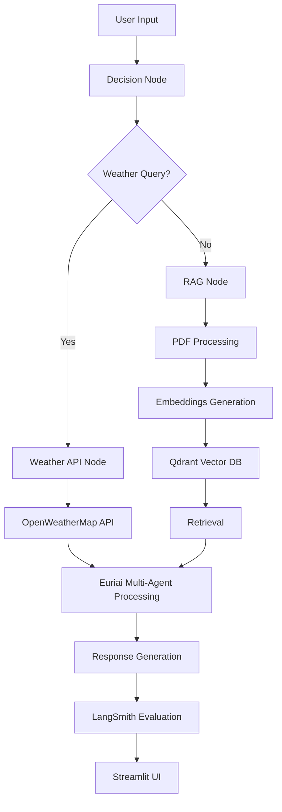

# AI Pipeline - Weather & RAG Assistant

A comprehensive AI pipeline demonstrating LangChain, LangGraph, and LangSmith integration for weather queries and RAG (Retrieval-Augmented Generation) from PDF documents, enhanced with Euriai multi-agent capabilities.

## 🎯 Features

- **🌤️ Real-time Weather Data**: Fetch weather information using OpenWeatherMap API
- **📚 RAG from PDF Documents**: Upload PDFs and ask questions about their content
- **🤖 LangGraph Decision Pipeline**: Intelligent routing between weather and RAG queries
- **🤖 Euriai Multi-Agent System**: Specialized agents for weather, RAG, and pipeline orchestration
- **📊 LangSmith Evaluation**: Automatic response quality assessment
- **🗄️ Qdrant Vector Database**: Store and retrieve document embeddings
- **💬 Streamlit UI**: User-friendly chat interface
- **🔧 Setup Script**: Automated installation and configuration

## 🏗️ Architecture



## 🚀 Quick Start

### Prerequisites

- Python 3.8+
- API keys for the following services:
  - Google Gemini API
  - OpenWeatherMap API
  - LangSmith API
  - Qdrant Vector Database

### Installation

1. **Clone the repository**
   ```bash
   git clone <repository-url>
   cd Neura-Dynamics
   ```

2. **Run the setup script**
   ```bash
   python setup.py
   ```
   
   This will:
   - Check Python version compatibility
   - Install all dependencies
   - Create a `.env` file template
   - Guide you through API key setup

3. **Set up environment variables**
   
   Create a `.env` file in the project root with your API keys:
   ```env
   GEMINI_API_KEY=your_gemini_api_key_here
   OPENWEATHER_API_KEY=your_openweather_api_key_here
   LANGSMITH_API_KEY=your_langsmith_api_key_here
   LANGSMITH_PROJECT=your_langsmith_project_name
   LANGSMITH_ENDPOINT=https://api.smith.langchain.com
   QDRANT_URL=your_qdrant_cluster_url
   QDRANT_API_KEY=your_qdrant_api_key
   COLLECTION_NAME=ai_pipeline_docs
   ```

### Running the Application

1. **Start the Streamlit app**
   ```bash
   streamlit run app.py
   ```

2. **Open your browser** and navigate to `http://localhost:8501`

3. **Initialize the pipeline** using the sidebar button

4. **Upload a PDF** (optional) for RAG functionality

5. **Start chatting!** Ask weather questions or questions about your uploaded PDF

## 🔧 API Setup Instructions

### 1. Google Gemini API
- Visit: https://makersuite.google.com/app/apikey
- Create a new API key
- Add to your `.env` file

### 2. OpenWeatherMap API
- Visit: https://openweathermap.org/api
- Sign up for a free account
- Get your API key from the dashboard
- Add to your `.env` file

### 3. LangSmith
- Visit: https://smith.langchain.com/
- Sign up for a free account
- Get your API key from settings
- Add to your `.env` file

### 4. Qdrant Vector Database
- Visit: https://cloud.qdrant.io/
- Create a free account
- Create a new cluster
- Get your cluster URL and API key
- Add to your `.env` file

## 📁 Project Structure

```
Neura-Dynamics/
├── app.py                    # Main Streamlit application
├── ai_pipeline.py           # Main LangGraph pipeline
├── euriai_service.py        # Euriai multi-agent service
├── weather_service.py       # OpenWeatherMap API integration
├── vector_store.py          # Qdrant vector database operations
├── pdf_processor.py         # PDF text extraction and chunking
├── evaluation_service.py    # LangSmith evaluation service
├── config.py               # Configuration management
├── setup.py                # Automated setup script
├── requirements.txt        # Python dependencies
└── README.md              # This file
```

## 🧪 Testing

The project includes a setup script that can run basic tests:

```bash
python setup.py
```

## 🔍 Usage Examples

### Weather Queries
- "What's the weather in London?"
- "Temperature in Tokyo"
- "How's the weather in New York?"
- "Is it raining in Paris?"
- "What's the air quality in Beijing?"

### RAG Queries (after uploading a PDF)
- "What is the main topic of the document?"
- "Summarize the key points"
- "What are the conclusions?"
- "Explain the methodology"

## 🏗️ Implementation Details

### LangGraph Pipeline

The application uses LangGraph to create a stateful workflow:

1. **Query Classification**: Determines if the query is weather-related or RAG-related
2. **Weather Processing**: Fetches real-time weather data from OpenWeatherMap
3. **RAG Processing**: Searches vector database for relevant document chunks
4. **Multi-Agent Processing**: Uses Euriai agents for specialized response generation
5. **Evaluation**: LangSmith evaluates response quality

### Euriai Multi-Agent System

The application uses three specialized agents:

1. **Weather Intelligence Agent**: Analyzes weather data and provides insights
2. **RAG System Agent**: Processes document content and answers questions
3. **AI Pipeline Agent**: Orchestrates responses and manages workflow

### Vector Database Integration

- Uses Qdrant for storing document embeddings
- Implements cosine similarity search
- Supports metadata storage and retrieval
- Automatic collection management

### PDF Processing

- Text extraction using PyPDF2
- Intelligent text chunking with overlap
- Metadata preservation
- Source tracking

### LangSmith Integration

- Automatic response evaluation
- Performance monitoring
- Quality assessment metrics
- Trace logging

## 🎨 Streamlit UI Features

- **Chat Interface**: Real-time conversation with the AI
- **PDF Upload**: Drag-and-drop PDF processing
- **Response Details**: Expandable sections showing pipeline internals
- **Vector Store Info**: Real-time database statistics
- **Error Handling**: Graceful error messages and recovery

## 🔒 Security Considerations

- API keys stored in environment variables using python-dotenv
- No hardcoded credentials
- Secure API communication
- Input validation and sanitization

## 🚀 Deployment

### Local Development
```bash
streamlit run app.py
```

### Production Deployment
1. Set up a production environment
2. Configure environment variables
3. Use a production-grade server (e.g., Gunicorn)
4. Set up monitoring and logging

## 📊 Monitoring and Evaluation

### LangSmith Dashboard
- Access your LangSmith project to view:
  - Response quality metrics
  - Performance analytics
  - Error tracking
  - Usage statistics

### Vector Database Monitoring
- Document count tracking
- Search performance metrics
- Storage utilization

## 🤝 Contributing

1. Fork the repository
2. Create a feature branch
3. Make your changes
4. Add tests for new functionality
5. Submit a pull request

## 📝 License

This project is licensed under the MIT License.

## 🆘 Troubleshooting

### Common Issues

1. **API Key Errors**
   - Verify all API keys are correctly set in `.env`
   - Check API key permissions and quotas

2. **Vector Database Connection**
   - Ensure Qdrant cluster is accessible
   - Verify network connectivity

3. **PDF Processing Issues**
   - Check PDF file format and size
   - Ensure PDF is not password-protected

4. **LangSmith Integration**
   - Verify LangSmith API key and project name
   - Check network connectivity to LangSmith

5. **Euriai Service Issues**
   - Check Euriai API key configuration
   - Verify network connectivity to Euriai services

### Getting Help

- Check the logs for detailed error messages
- Verify all dependencies are installed
- Ensure Python version compatibility
- Review API documentation for service-specific issues

## 📈 Performance Optimization

- Implement caching for weather data
- Optimize vector search parameters
- Use batch processing for large PDFs
- Monitor memory usage and optimize accordingly

---

**Built with ❤️ using LangChain, LangGraph, Euriai, and Streamlit** 